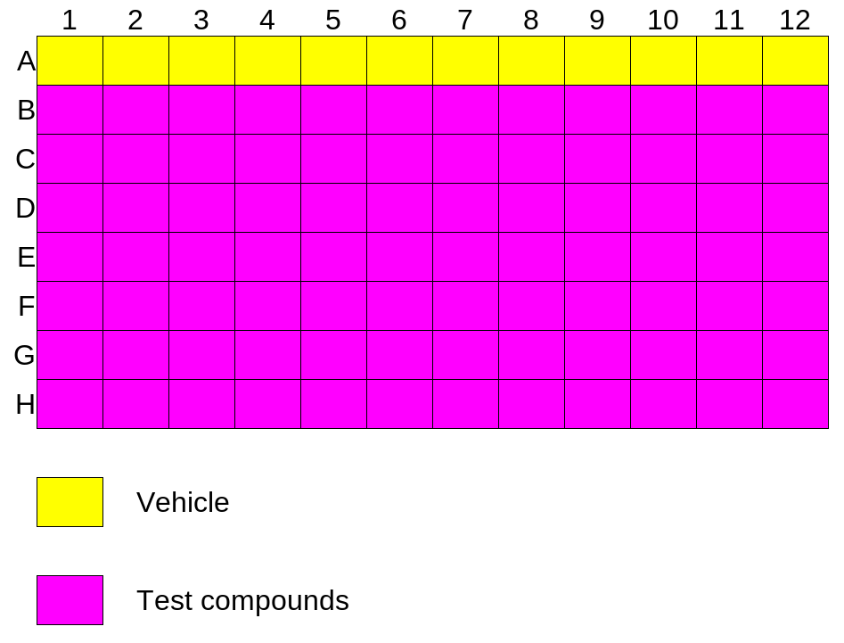
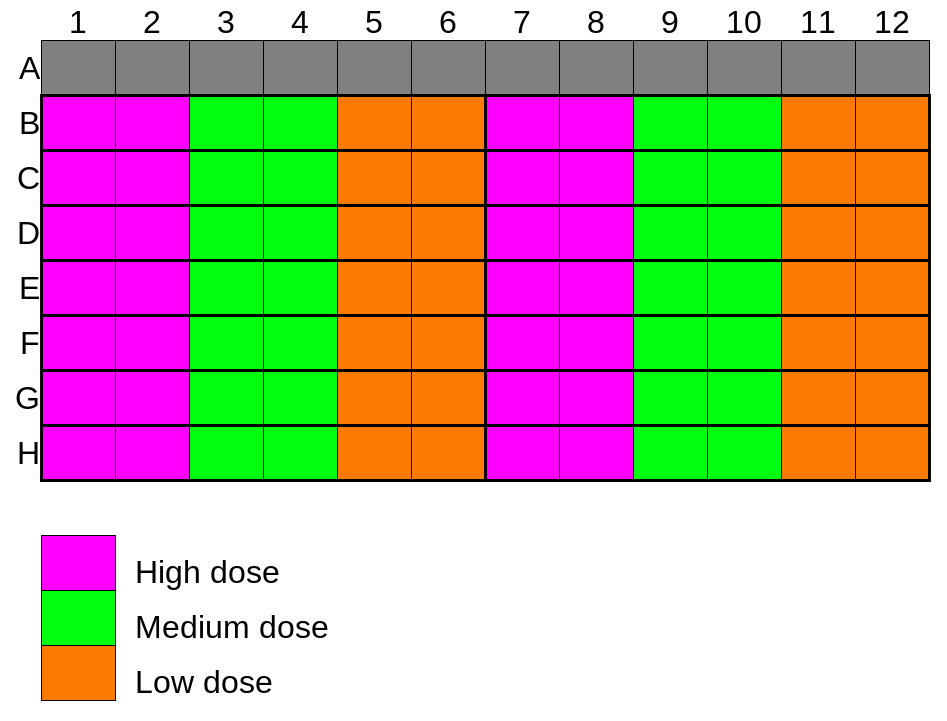
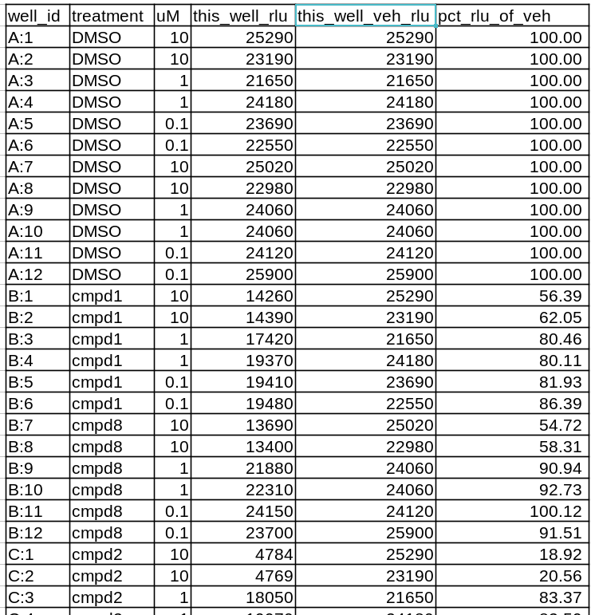

# hibit96

## Copyright
SLD 2023

## License Information
This program is free software: you can redistribute it and/or modify it under the terms of the GNU General Public License as published by the Free Software Foundation, either version 3 of the License, or (at your option) any later version.

This program is distributed in the hope that it will be useful, but WITHOUT ANY WARRANTY; without even the implied warranty of MERCHANTABILITY or FITNESS FOR A PARTICULAR PURPOSE. See the GNU General Public License for more details.

You should have received a copy of the GNU General Public License along with this program. If not, see <https://www.gnu.org/licenses/>. 

## Description
Script for normalizing test-well RLU data, to on-plate vehicle-well RLU data, as acquired as comma-separated values (CSV) by a GloMax Discover instrument, using 96wp acquisition format.

With such data, this script will:

- Collect all data (and all its annotations: treatments & doses)

- From all data, collect vehicle-well data

- Re-express all data as percent of vehicle-well-in-column

- Output raw and normalized data, well by well, with annotations

This script was designed around output from SLD's 96wp CCNE1 HiBiT assay, but will operate equally well for any 96wp RLU data acquired on a GloMax Discover instrument (e.g., would be acceptable for normalizing CellTiter-Glo data), given the same plate layout assumptions

## Input Requirements
Script requires the following files:
- ```data.csv```: CSV output from GloMax Discover (expect 97 rows: 1x label, 96x data)
- ```annot.csv```: List of treatments (expect 16 treatments)
- ```doses.csv```: List of doses, in uM (expect 3 doses)

Script expects that ```data.csv``` was acquired on a GloMax Discover instrument, with 96w aperture, with all wells sampled, from a plate obeying this layout:



Expect technical duplicates of three decreasing dose points, left-to-right in adjacent columns; and 2x treatment conditions per row, as per this layout:



If successful, should receive CSV output resembling the following: treatment names and doses mapped onto well IDs, along with corresponding raw and normalized data:


